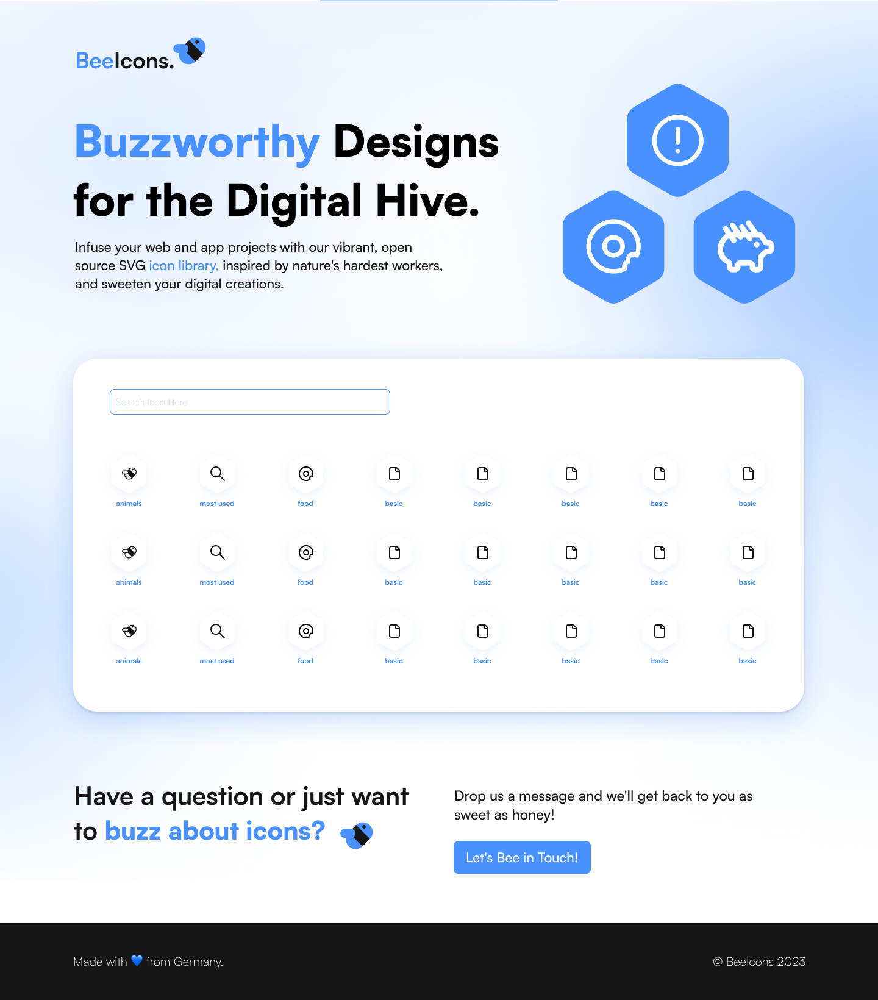

<div align="center">



# 💙 BeeIcons


Your new favourite icon pool!

</div>

## 🍯 Why this project

**We really love icons.**

We do it to the extent to feel really chilled when we create them.

For some people, drawing or coloring mandalas might work, this works for us.

And also we can use them lately in our projects.

We got really inspired by bigger projects like [thenounproject](https://thenounproject.com/) and [tabler-icons](https://tabler-icons.io/), and decided to go create something as cool.

By the way, **if you want to give a try to mindful creating icons, you can always create a PR**. Just add some icons in the file `icons.json`. We will take a look carefully!

All the icons are completely made by us from the very first pixel and free to use it, **either in personal or commercial projects**.

## 🪜 Next Steps

- [x] Add thumbnail for sharing the app
- [x] Create component that renders the icon (24x24) by default
- [ ] Create functions that get the icon by name, and also get other icon sizes by name
- [x] Create search filter function
- [x] Create the icon Hive Cell component
- [x] Create a simple pagination system (show max number of icon per view)
- [x] Click the icon will download automatically 24x24 version (later we will have a modal)
- [ ] Add glassmorphism background
- [x] Add filter by category

## How to collaborate on the project

Here we have an example of an icon. There are some things we need to pay attention to:

- We are continuing with the id order.
- We are deciding a **name**, so we will have to check if our name is not taken yet.
- Then we are diving into the different sizes of the icon. The required one for the moment is 24x24 (which is 'lg').
- A class _bee bee-icons_ must be added in all the sizes.
- Also take care that the clip-path values and ids say meaningful information about the icon, and not just the numbers generated by Illustrator or Figma, for example.
- Replace every instance of 'black' with 'currentColor', so that every user can later use any color they want through the CSS color property.
- Category refers to -but not only- the main category of the icon. For the moment we are placing all in basics, but soon a better categorization will be found.
- Tags are words that we can insert in the search field that will lead to find your icon.

In case of doubt you can always share with us on an issue your project or create a Pull Request, and we will bee in touch with you as soon as we can!

```json
{
    "id": 68,
    "name": "copy",
    "icon": {
      "xs": "",
      "sm": "",
      "md": "",
      "lg": "<svg class='bee bee-icons' width='24' height='24' viewBox='0 0 24 24' fill='none' xmlns='http://www.w3.org/2000/svg'><g clip-path='url(#copy-lg-clip)'><path d='M9 16V4C9 3.44772 9.44771 3 10 3H16.5507C16.804 3 17.048 3.09619 17.2332 3.26914L19.6825 5.55651C19.885 5.74563 20 6.01029 20 6.28737V16C20 16.5523 19.5523 17 19 17H10C9.44772 17 9 16.5523 9 16Z' stroke='currentColor' stroke-width='2' stroke-linecap='round'/><path d='M7.91774 8H5C4.44772 8 4 8.44772 4 9V21C4 21.5523 4.44772 22 5 22H14C14.5523 22 15 21.5523 15 21V17.9556' stroke='currentColor' stroke-width='2' stroke-linecap='round'/></g><defs><clipPath id='copy-lg-clip'> <rect width='24' height='24' fill='none'/></clipPath></defs></svg>",
      "xl": ""
    },
    "category": ["basic"],
    "tags": ["copy", "clipboard", "duplicate"]
  },
```

## 📧 Contact

If you want to contact us, you can always send an email to [manusanchezweb@gmail.com](mailto:manusanchezweb@gmail.com) or create an issue in this repo. We will come back to you as sweet as honey!
